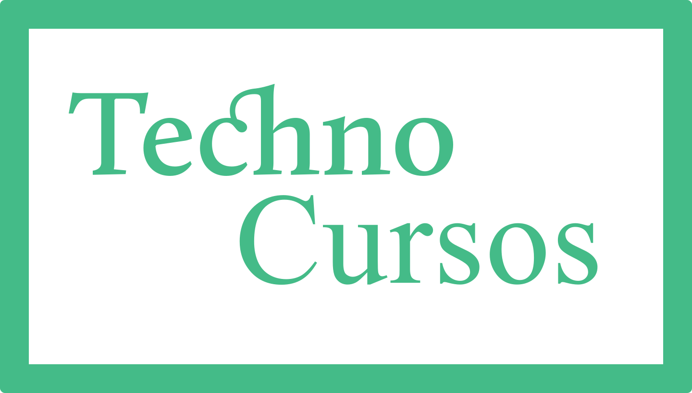

# Techno

 

  

 

## :bookmark_tabs: Sobre

Mini Projeto desenvolvido no curso Vue.js

Intituição - Origamid

Professor - André Rafael

 

## :rocket: Tecnologias

- HTML5
- CSS3
- JavaScript
- Vue.js
- Vue Router

 

## :green_book: Licença 

Esse projeto está sob a licença MIT. Veja o arquivo [LICENSE](LICENSE) para mais detalhes.

 

---

    <b>Desenvolvido por Guilherme Assunção</b>

